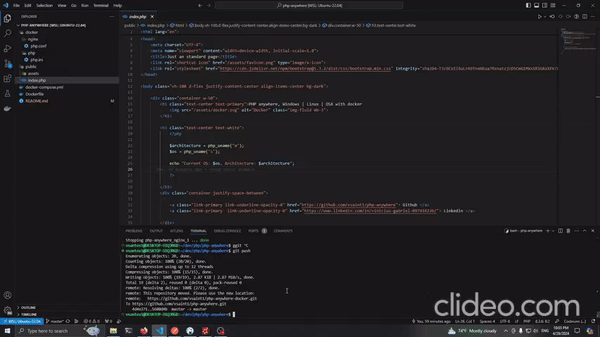

# php-anywhere

This project aims to help you `build/develop` [PHP](https://www.php.net) applications in Docker containers without having to install anything locally.

**Works with any PHP application type/framework**

## Demo 

Live `reload`, almost no configuration delopy and easy to use.



# Requirements

- Any operating system with [Docker](https://www.docker.com)


# Project Specifications **[DOC]**

- Nginx config file with fast_cgi default configuration, you can change it in `docker/nginx/php.conf` file

- PHP config file with some configs, you can change it in `docker/php/php.ini` file

- Current default project services running are `nginx`, `php`, `redis` and `sqlserver`

1. app service:

    - `php-fpm`

    - `composer`

    - `php-extensions`

2. nginx service:

    - `nginx`

    - `fast_cgi`
3. db service:

    - `mssql`

4. redis service:

    - `redis`

# How to use **[CONFIGURATION]**

```nginx

# current
fastcgi_pass app:9000; 

# docker/nginx/php.conf
fastcgi_pass container_name:fpm_port;  # MUST FOLLOW THIS PATTERN

```


```yml
#docker-compose.yml
app:
    build:
        context: .
        dockerfile: Dockerfile
    restart: unless-stopped
    working_dir: /var/www/
    networks:
        - php_anywhere_network
    volumes:
        - ./:/var/www
    depends_on:
        - redis
        - db
```


# Running **[COMMANDS]**

> Starting services dettached
```bash

docker-compose up -d 

```

> Entering into container

```bash

docker exec -it container_name bash

```

> Stopping services

```bash

docker-compose stop

```

> **[NOTES]**:  This is "base" project, you can configure and change everything.
